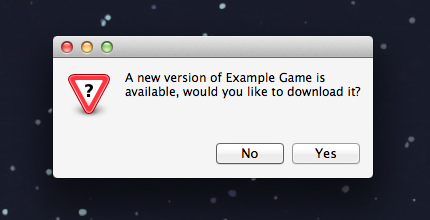
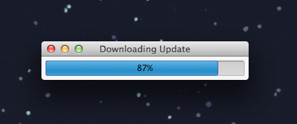
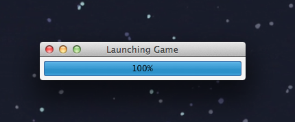

Indie Launcher
==============

Indie Launcher is a customisable, unobtrusive Launcher application that you can use to transparently provide automatic updates for your Indie Game. Updates are published by editing an RSS file on your website, and are automatically detected by the launcher when your users try to run your game.

There's no system tray apps, background processes or login screens, just an small process that checks for updates to your game, downloads them, then launches your game and gets out of the way.

Screenshots
===========

Creating a Launcher for your game
=================================

The code in this repository provides a launcher that downloads the example game hosted [here](https://github.com/dan200/IndieLauncherExampleGame). To customise it into a launcher that will update and launch *your* game, you'll need to make some small changes:

1. Take a look at the [Example Game RSS file](https://github.com/dan200/IndieLauncherExampleGame/blob/master/ExampleGame.xml), customise it with the download links for your game, and host it somewhere online. Each entry in the RSS file represents a version of the game, and newer versions go at the top.

2. Download this repository, and take a look at [IndieLauncher/EmbeddedGame.txt](https://github.com/dan200/IndieLauncher/blob/master/IndieLauncher/EmbeddedGame.txt), change the "game" field to the channel title from your RSS feed, and the "url" feed to where you have your RSS file hosted.

3. Optionally, you can embed a version of the game within the launcher itself, so that users without an active internet connection will always have something to play when they first run your launcher. Overwite [IndieLauncher/EmbeddedGame.zip](https://github.com/dan200/IndieLauncher/blob/master/IndieLauncher/EmbeddedGame.zip) with this file, and set the "version" field in EmbeddedGame.txt with the version of the game it represents. If you skip this step, remove this line and delete EmbeddedGame.zip.

4. Customise the Assembly Name and Icon to whatever you want your users to see, and build the soluton. The resultant .exe is standalone, and will update and run your game when it gets launched. Distribute it to your players however you like, and they'll always be up-to-date when you publish new versions of your game!
